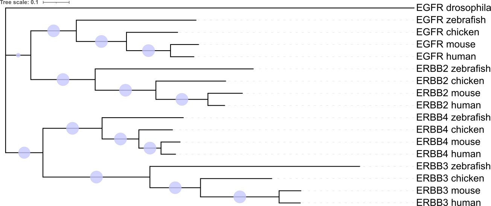
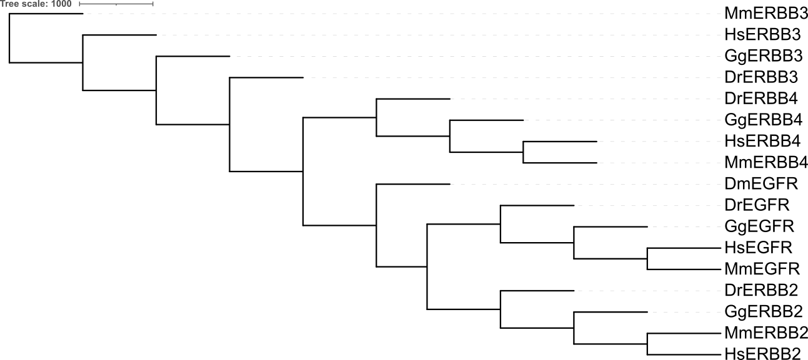

# Comparative Phylogenomics of the ErbB/RTK Gene Family

A variant interpretation pipeline combining exome sequencing, cross-species multiple sequence alignment, and phylogenetic reconstruction to assess evolutionary conservation at human mutation sites.

## Motivation

Distinguishing pathogenic mutations from benign variants in human exome data remains a major clinical bottleneck. Population-frequency databases capture recent demographic constraint but are blind to deep evolutionary constraint. This project implements an independent analytical approach: mapping human ErbB variants onto the evolutionary history of the receptor family across ~700 million years of divergence.

## Key Result

Of 15 ErbB variants identified in NA12878, six fall in coding regions and could be mapped to the codon-aware alignment. The most notable is **ERBB2 p.Pro1170Ala**, a missense substitution at a position invariant across amniotes (human, mouse, chicken) for ~310 million years. The variant reverts the residue to the zebrafish state, is absent from ClinVar, and is therefore classified as a Variant of Uncertain Significance (VUS) with strong evolutionary evidence of functional constraint.

## The ErbB Family

The ErbB receptor tyrosine kinases (EGFR, ERBB2/HER2, ERBB3/HER3, ERBB4/HER4) are among the most clinically actionable oncogenes. They arose through two rounds of whole-genome duplication at the origin of vertebrates. Their sequences span the full vertebrate radiation and into invertebrates.

## Pipeline

### Phase 1 — Data acquisition and QC
- NA12878 (GIAB) paired-end exome FASTQ from NCBI SRA (Garvan dataset)
- Reference: GRCh38 no-alt analysis set
- QC: FastQC + Trimmomatic (91.65% paired read retention)
- 17 ErbB family coding sequences (5 vertebrates + Drosophila outgroup)

### Phase 2 — Variant calling
- BWA-MEM 0.7.19 alignment to GRCh38 (100% mapped, 99.47% properly paired)
- bcftools mpileup + call (diploid model)
- Quality filter: QUAL >= 30, DP >= 10, MQ >= 30
- Subset to ErbB gene bodies: **15 variants** (EGFR: 7, ERBB2: 4, ERBB3: 3, ERBB4: 1)

### Phase 3 — Multiple sequence alignment
- Codon-aware alignment via translation -> MAFFT -> PAL2NAL back-translation
- Alignment: 17 taxa x 5,727 columns (1,909 codons)

### Phase 4 — Phylogenetic reconstruction

Two independent methods:
- **PHYLIP Neighbor-Joining** with 1000 bootstrap replicates
- **IQ-TREE Maximum Likelihood** (GTR+F+I+G4, 1000 UFBoot + 1000 SH-aLRT)

Both methods recovered identical topology: four monophyletic paralog clades with 100/100 bootstrap support, consistent with the 2R hypothesis of vertebrate genome duplication.

### Phase 5 — Conservation analysis
- Ensembl VEP REST annotation of all 14 SNVs
- 6 coding-region variants mapped to the codon alignment
- Coordinate reconciliation across Ensembl vs RefSeq CDS (+/- 20 nt window, documented)

**Key finding:** The ERBB2 missense variant p.Pro1170Ala falls at a position invariant in amniotes (human, mouse, chicken) for ~310 Myr. The variant reverts the residue to the zebrafish state and is absent from ClinVar (as of 2026-10), classifying it as a Variant of Uncertain Significance (VUS).

## Phylogenetic Trees

The ErbB family tree was reconstructed using two independent methods. Both recovered congruent topologies with bootstrap support of 100 on all four paralog clades.

### Maximum Likelihood (IQ-TREE, GTR+F+I+G4)

### Neighbor-Joining (PHYLIP, Kimura 2-parameter)

PDF versions (vector, publication-quality) are in `results/figures/`.

## Repository Structure

    erbb-phylogenomics/
    |-- data/                  # FASTQ (local, gitignored)
    |-- reference/             # GRCh38 + BWA index (local, gitignored)
    |-- results/
    |   |-- alignments/        # Codon-aware MSA (fasta, nex, phy)
    |   |-- trees/             # PHYLIP NJ consensus tree
    |   |-- trees_iqtree/      # ML tree + IQ-TREE report
    |   |-- vcf/               # Variant summary + ErbB variant table
    |   |-- conservation/      # VEP output, conservation scoring, report
    |   +-- figures/           # Tree images (PNG, PDF)
    |-- scripts/               # Pipeline scripts
    +-- docs/                  # SCOPE.md, PROGRESS.md, PORTFOLIO_NOTES.md

## Reproducibility

The full pipeline is scripted and idempotent. To reproduce:

    conda create -n erbb python=3.11 -y
    conda activate erbb
    conda install -c bioconda -c conda-forge \
      fastqc trimmomatic bwa samtools bcftools tabix \
      muscle clustalo mafft pal2nal seqkit emboss phylip iqtree -y

    bash scripts/01_download_data.sh
    bash scripts/02_qc_and_trim.sh
    bash scripts/03_msa_pipeline.sh
    bash scripts/04_variant_calling.sh
    bash scripts/05_phylogenetics.sh
    bash scripts/06_conservation_analysis.sh

See `scripts/README.md` for prerequisites, runtimes, and known pitfalls (FTP blocking, PHYLIP menu order, Ensembl/RefSeq CDS drift).

## Software

- **Alignment**: BWA-MEM 0.7.19, samtools 1.21
- **Variant calling**: bcftools 1.21
- **Multiple sequence alignment**: MAFFT 7.525, PAL2NAL 14.1
- **Phylogenetics**: PHYLIP 3.697, IQ-TREE 3.1.4
- **Annotation**: Ensembl VEP REST API
- **Scripting**: Bash 5.x, Python 3.11, Biopython
- **Visualization**: iTOL

## Limitations

- A formal GIAB benchmark (bcftools isec against the NIST v4.2.1 high-confidence truth set) was not completed. Alignment quality metrics (100% mapped, 99.47% properly paired) suggest high accuracy, but quantitative precision/recall were not measured against the truth set.
- Ensembl VEP and RefSeq annotate CDS starts differently for some transcripts. The +/- 20 column reconciliation window used here absorbs small shifts but does not verify the exact codon boundary.
- Only one individual (NA12878) was analyzed. Population-scale generalizability would require additional samples.
- The Drosophila outgroup sits on a very long branch (~1.6 substitutions/site), which is normal for a pre-duplication lineage but limits resolution of basal nodes.
- Conservation was scored over five vertebrate species plus one insect outgroup. Adding amphibian, reptile, or additional fish taxa would strengthen the constraint signal.

## Author

**Preet Beniwal** — Independent bioinformatics portfolio project.
GitHub: [@preet-beniwal](https://github.com/preet-beniwal)

## License

MIT — see [LICENSE](LICENSE).
